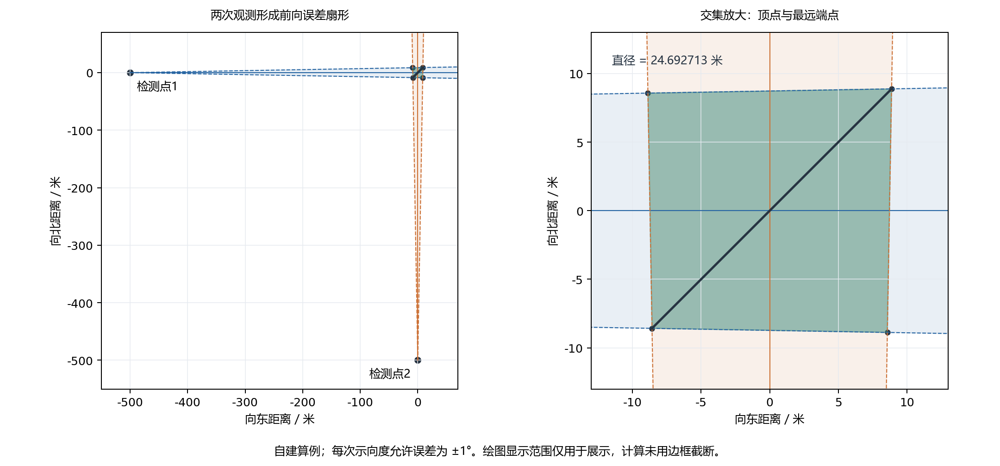
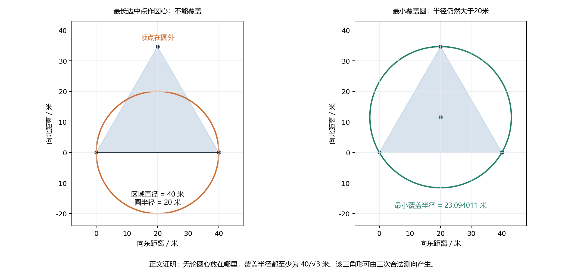

# 第一问：交会定位区域的直径与圆覆盖

本解答为完整候选结果：包括数学定义、算法、正确性证明、可运行程序和自建算例验证。题意依据为[题面第一问及附录2第1—3条](../../problem/B题.md)。算法和验证由AI完成，团队人工审阅尚未登记；正式采用后再整理进入 `src/`、`outputs/` 和 `paper/`。

**结论：将每次测向的 ±1° 前向扇形写成两个半平面，求公共区域，再取最远顶点对的距离，即得到非空有界多边形的直径。以这个直径为直径的圆，不一定能覆盖整个区域，甚至可能不存在任何合适的圆心。**

## 1. 第一问究竟计算什么

已知同一干扰源的检测点 $p_i=(x_i,y_i)$ 和示向度 $\theta_i$，$i=1,\ldots,N$。坐标单位为米；方向角从正东起逆时针计量，范围为 $[0^\circ,360^\circ)$。设未知源位置为 $s=(x,y)$。

题面给出真实方位与示向度的误差范围为 $[-1^\circ,1^\circ]$。记半张角 $\delta=1^\circ$，每次观测确定一个朝前张开的无限扇形 $W_i$。第一问所称的多边形定位区域取为

$$P=\bigcap_{i=1}^N W_i.$$

这与附录2图2中虚线围出的交会区域对应。它包含所有满足这些**测向约束**的位置；在理想精确运算下，真实源必属于它。第一问没有提供固定的一组数值观测，因此下文数值例子均明确标为自建算例。

1800米目标域、有效接收距离、近场条件是可进一步利用的信息，但加入圆盘或排除近场圆盘后，边界可能包含圆弧。这里不将它们悄悄加入 $P$，也不用任意大矩形把无界区域截成有限区域。误差只作为确定的范围，不假设正态、独立或零均值。

## 2. 从示向度得到半平面约束

令 $u(\alpha)=(\cos\alpha,\sin\alpha)$，定义二维叉积 $[a,b]=a_xb_y-a_yb_x$。角度代入程序中的三角函数前转换为弧度。

两条边界方向分别为 $u_i^-=u(\theta_i-\delta)$ 和 $u_i^+=u(\theta_i+\delta)$。源必须位于下边界的左侧、上边界的右侧，因此

$$W_i=\{s:[u_i^-,s-p_i]\ge0,\quad [u_i^+,s-p_i]\le0\}. \tag{1}$$

为什么这不会把身后的反向区域算进去？以中心方向及其垂线为局部坐标，令 $s-p_i=a u(\theta_i)+b u(\theta_i+90^\circ)$。式(1)等价于

$$-a\tan\delta\le b\le a\tan\delta.$$

因为 $0<\delta<90^\circ$，它要求 $a\ge0$，同时限制横向偏离，恰好形成前向扇形。式(1)使用正弦和余弦，因此示向度跨越 $0^\circ$ 时不需要人为拆分角度区间。扇形顶点按闭集合处理；近场信息不属于本问的纯扇形模型。

写成统一形式 $n_k\cdot s\le b_k$ 时，两组单位法向量为

$$n_i^-=(\sin(\theta_i-\delta),-\cos(\theta_i-\delta)),\qquad
n_i^+=(-\sin(\theta_i+\delta),\cos(\theta_i+\delta)),$$

对应右端为 $b_i^\pm=n_i^\pm\cdot p_i$。总计 $m=2N$ 个半平面，于是

$$P=\{s:n_k\cdot s\le b_k,\ k=1,\ldots,m\}. \tag{2}$$

半平面是凸集，其交集仍为凸集。这是后续只需考察顶点的基础。

## 3. 求交会区域的算法及理由

采用适合本题少量检测点的枚举算法。以下论证指精确数学运算；双精度实现的容差另见第7节。

### 3.1 计算候选顶点

任取两条不平行边界，记法向量为 $a=(a_x,a_y)$、$b=(b_x,b_y)$，右端为 $\alpha,\beta$。令 $\Delta=a_xb_y-a_yb_x\ne0$，其交点为

$$x=\frac{\alpha b_y-\beta a_y}{\Delta},\qquad
y=\frac{a_x\beta-b_x\alpha}{\Delta}. \tag{3}$$

对该交点检查全部不等式，只保留满足式(2)的点。

**为什么不会漏掉顶点？** 一个二维半平面交集的顶点，必有两个线性独立的有效边界约束。否则，该点可沿所有有效边界共同允许的切向作微小的正反向移动；其余严格不等式仍成立，该点就处于可行线段内部，不能是顶点。因此，每个顶点都会出现在式(3)的枚举中。反过来，一个满足全部约束的独立边界交点就是极点。对有界交集，将这些点去重并按凸包排列即可恢复区域；线段端点和单点同样能由有效边界交点得到。

### 3.2 区分空集和无界区域

“没有找到交点”不一定意味着空集，例如一个半平面或一条无限条带没有顶点。为此增加以下必要处理。

**可行性检查。** 检查原点、原点到各边界的垂足及保留的交点，任一满足全部约束即给出可行点。若都不满足，则区域为空。其理由是：非空闭凸多面集到原点的最近点存在；它要么是原点，要么位于某条边界内部且为该边界的垂足，要么是边界交点。法向量先单位化，边界 $n\cdot s=b$ 的垂足就是 $bn$。

**有界性检查。** 已找到可行点 $s_0$ 后，检查是否存在非零向量 $d$ 满足

$$n_k\cdot d\le0\quad\text{对全部 }k\text{成立}. \tag{4}$$

若存在，则 $s_0+td$ 对任意 $t\ge0$ 都可行，区域无界。反之，无界区域可取一列离 $s_0$ 越来越远的点，将差向量单位化后取收敛子列，便得到满足式(4)的单位向量。因此式(4)是充要条件。

二维情况下，如约束不为空，非零可行方向锥必在某条约束边界上含有非零方向，故枚举每个法向量的两个垂直方向即可；没有约束时整个平面可行，直接报告无界。

### 3.3 算法伪代码

```text
输入：同一源的 N 个检测点及示向度
1. 将每次 ±1° 前向扇形转换成两个半平面。
2. 枚举所有不平行边界对，保留满足全部约束的交点。
3. 用原点、边界垂足、可行交点检查可行性。
   若不可行，返回“空集，观测不相容，直径未定义”。
4. 检查是否存在非零无界方向。
   若存在，返回“无界，直径为正无穷”及可行点/方向。
5. 对交点去重、求凸包，得到有序顶点。
6. 比较全部顶点对，返回最大距离及对应端点。
```

对于无界集，“直径为正无穷”采用距离上确界的扩展定义。它并不存在实现最大距离的有限端点对。

## 4. 为什么只比较顶点就能得到直径

设非空有界区域为 $P=\operatorname{conv}\{v_1,\ldots,v_v\}$，其直径是

$$D(P)=\max_{x,y\in P}\|x-y\|.$$

任意 $x,y\in P$ 均能表示为顶点的凸组合，记 $x=\sum_i\lambda_i v_i$、$y=\sum_j\mu_jv_j$，其中系数非负且各自和为1。由三角不等式，

$$\|x-y\|=\left\|\sum_{i,j}\lambda_i\mu_j(v_i-v_j)\right\|
\le\sum_{i,j}\lambda_i\mu_j\|v_i-v_j\|
\le\max_{i,j}\|v_i-v_j\|.$$

顶点本身属于 $P$，反方向的不等式也成立，故

$$\boxed{D(P)=\max_{i,j}\|v_i-v_j\|.} \tag{5}$$

单点直径为0；线段直径就是两端点距离。空集不会被误当成“直径为0、定位成功”。

**复杂度。** 枚举 $O(m^2)$ 个边界对，每个检查 $m$ 条约束，主成本为 $O(m^3)$。可行性和方向检查不超过此量级。有界交集的不同顶点数 $v\le m$；去重、凸包整理不改变上述主阶。计算直径需比较 $O(v^2)$ 个点对。总时间为 $O(m^3+v^2)$，当前枚举实现至多使用 $O(m^2+v^2)$ 存储。不为本问额外引入复杂的求解器或路线优化算法。



图1来自两个检测点 $(-500,0)$、$(0,-500)$，示向度分别为 $0^\circ$、$90^\circ$。设 $t=\tan1^\circ$，可独立推出该四边形直径为 $1000\sqrt2\,t/(1-t^2)=24.6927129119$ 米。图中的绘图窗口没有参与区域计算。

## 5. 直径相同的圆不一定能覆盖区域

### 5.1 不是换个圆心就一定可以

取边长40米的等边三角形

$$A=(0,0),\qquad B=(40,0),\qquad C=(20,20\sqrt3).$$

由式(5)，其直径为40米。记重心 $G=(20,20\sqrt3/3)$。对任意圆心 $c$，有平方距离恒等式

$$\frac{\|c-A\|^2+\|c-B\|^2+\|c-C\|^2}{3}
=\|c-G\|^2+\frac{40^2}{3}\ge\frac{40^2}{3}.$$

三个距离的最大值至少为均方根，因此任何覆盖三角形的圆都必须满足

$$r\ge\frac{40}{\sqrt3}\approx23.0940107676\text{ 米}>20\text{ 米}. \tag{6}$$

取圆心为 $G$ 时到三个顶点的距离均为 $40/\sqrt3$；圆盘为凸集，包含顶点即包含整个三角形，所以该下界可以达到，是最小覆盖半径。这证明了：**任何直径为40米的圆都不够大**，而不只是某个圆心选得不好。

### 5.2 该反例能由合法测向得到

对每条逆时针边 $a\to b$，记单位方向 $e=(b-a)/40$。取检测点 $p=a-1000e$，示向度为该边方位角加 $1^\circ$。三个具体观测为：

| 检测点 | 坐标/米 | 示向度 |
| --- | --- | --- |
| $p_1$ | $(-1000,0)$ | $1^\circ$ |
| $p_2$ | $(540,-500\sqrt3)$ | $121^\circ$ |
| $p_3$ | $(520,520\sqrt3)$ | $241^\circ$ |

每个扇形的一条边界恰好沿相应三角形边，限定其内侧；另一条边界在逆时针 $2^\circ$ 处。第三顶点相对边方向的偏角为

$$\arctan\frac{20\sqrt3}{1020}<2^\circ,$$

所以该扇形包含整个三角形。三个三角形内侧半平面的交集已经恰为三角形，额外三条边界又不切掉三角形，故三个扇形的交集恰好为 $ABC$。

再取实际全向源为 $G$、有效接收半径为1100米。到三个检测点的距离均为

$$\sqrt{1020^2+400/3}\approx1020.0653573832\text{ 米},$$

真实方位分别约为 $0.6485945^\circ,120.6485945^\circ,240.6485945^\circ$，读数误差均约 $+0.3514055^\circ$。实际源在1800米目标域内，检测距离大于5米且小于1100米，接收半径也在题目允许范围内。整个三角形的候选位置都落在各检测点1100米圆盘内，因此反例并非由违反接收条件的顶点造成。



## 6. 可运行结果与检验

第一问入口只读取 `observations`，不读取算例中的 `source_m`。后者专供生成后的物理条件核验，不能作为求解输入。程序复用旧共有模块的 `bearing_halfplanes`、`halfplane_region`、`polygon_diameter`；物理半张角显式传入1°。为防止宿主程序中同名 `geometry` 模块被误导入，共有模块改为按自身相对文件路径加载既有底座，冻结底座本身未修改。

实际结果保存在 [examples.json](results/examples.json)。以下只为阅读方便进行小数舍入，完整精度以生成文件为准。

| 自建算例 | 观测数 | 区域 | 解析直径/米 | 程序直径/米 |
| --- | ---: | --- | ---: | ---: |
| 两个垂直方向测向 | 2 | 四边形 | 24.6927129119 | 24.6927129119 |
| 四条边生成4×3矩形 | 4 | 矩形 | 5 | 5.0000000000 |
| 三条边生成等边三角形 | 3 | 三角形 | 40 | 40.0000000000 |

已执行的31项测试全部通过：第一问15项，原共有几何16项。后者包含旧第二问相关回归，仅用于确认导入修正不破坏原功能，不代表本轮完成第二问。测试细节、执行时间、命令与原始输出见[自动生成的验证记录](results/VALIDATION.md)。

第一问检查包含：完整观测链与解析坐标核对；所有输出顶点满足原始角度条件；三角形的接收距离和误差；固定种子的旋转/平移；观测重排与重复；增加相容观测后直径不增；必要退化情况；0°附近角度；独立命令行及同名模块隔离。近乎平行的解析算例产生超过400万米的有限直径，用来确认求解器没有被绘图或目标区域边框截断。

这些测试是实现正确性的有限证据，数学命题依靠上述证明成立；没有将测试数量解释为统计失败率或官方成绩。

## 7. 数值范围与后续两问的接口价值

程序采用双精度，先将首个检测点平移到原点，降低公共坐标偏移导致的消减误差。法向量单位化后，约束判定和顶点去重的距离容差为 $10^{-7}$ 米；边界平行和无界方向检查使用 $10^{-12}$ 的无量纲阈值。**这些是数值判断阈值，不是给物理误差增加角度。**

接近上述阈值的极窄区域、几乎平行的边界或极大坐标可能发生分类不稳定；本实现不是任意尺度上的精确算术或严格区间包围证书。计算溢出、出现有界非空却无顶点的矛盾时明确报错，不能静默输出成功。若实际观测落入数值临界情况，应对相应输入作高精度复核；本轮不将大规模病态输入研究列为主任务。

对第二问，本问提供“给定新增观测后，如何算更新区域及其直径”的基础工具；选点时尚未知新示向度，因此仅有此工具还不能替代第二问的选点策略。

对第三问，若当前相容集为凸多边形 $K=\operatorname{conv}\{v_j\}$，某清除点 $c$ 能覆盖全部候选位置的条件是

$$\max_j\|v_j-c\|\le20\text{ 米}.$$

若允许自由选择 $c$，则存在可靠清除点当且仅当 $K$ 的最小覆盖圆半径不超过20米。$D(K)\le40$ 米只是必要条件，等边三角形反例说明它不是充分条件。将数值几何接入可靠清除流程时，还需核对该流程的相容集外包和数值余量，不能把本问的名义直径直接当作清除保证。本轮没有改动第三问的行动策略。

## 8. 复核入口

- [运行说明与输入输出](README.md)
- [求解入口](solver.py)、[算例生成](run_examples.py)、[测试代码](test_solver.py)
- [生成结果](results/examples.json)、[验证记录](results/VALIDATION.md)、[图表来源散列](results/figures_manifest.json)

本问未使用外部数据或竞赛答案，所有反例与证明均在文中给出。独立运行入口复用现有项目中的共有几何代码，复现时须保留 README 列出的依赖文件。
